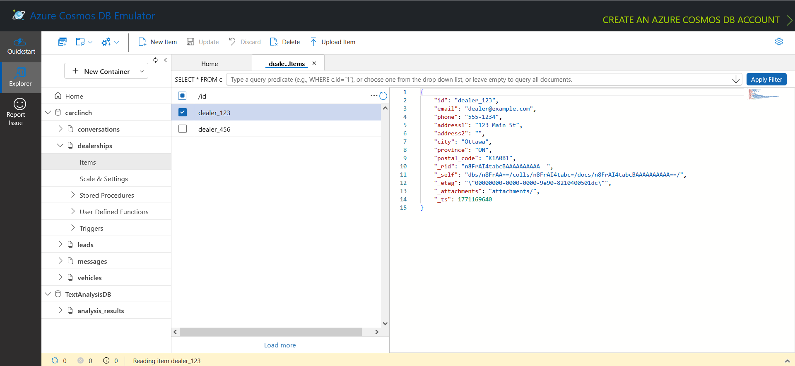

# Quick Reference Guide: CosmosDB (NoSQL) + Docker/Installer (Windows)

This QRG will have you set up Cosmos DB emulator and also seeds the DB with a script that inits all containers and seed vehicles and dealerships.

## 1. Start/Install CosmosDB Emulator

Follow the instructions for the options here: [Cosmos DB Emulator Setup](https://learn.microsoft.com/en-us/azure/cosmos-db/how-to-develop-emulator?tabs=windows%2Ccsharp&pivots=api-nosql)

IMO if you have Windows, use the installer. If you have Linux, use Docker. The Windows Docker image is extremely heavy.

---

## 2. Init the containers
1. Activate your virtual environment and install dependencies.

macOS/Linux
```bash
source .venv/bin/activate
pip install -r requirements.txt
```

Windows
```bash
.venv\Scripts\activate
pip install -r requirements.txt
```

2. Run the script to init containers & seed data:
```bash
python init.py
```

3. Navigate to the following:
```
https://localhost:8081/_explorer/index.html
```

TADA!!


